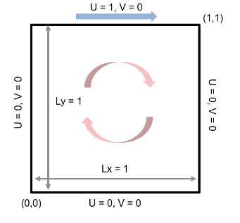

# Problema de Cavidade Quadrada

## Condições de contorno

| Parede | Velocidade prescrita | Observação            |
|-------:|:--------------------|:----------------------|
| Tampa  | **u** = (1 m/s, 0)  | *Lid‑driven*          |
| Laterais e base | **u** = (0, 0) | Não‑deslizamento |

- Comprimento característico: $L = 1\,\text{m}$
- Densidade: $\rho = 1\,\text{kg/m³}$
- Viscosidade cinemática $\nu$ variável

O número de Reynolds é dado por

$$
  Re = \frac{L\,U_{\text{lid}}}{\nu}.
$$
