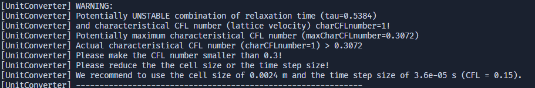

# Diagnósticos de Estabilidade

**Reynolds muito alto** → use resolução maior.
Frequência de relaxação  

$$  
\omega = \frac{1}{3\,\nu + 0.5}  
$$

e 
$$
CFL = \frac{u * \delta{t}}{\delta{x}}
$$

  Deve obedecer $0 < \omega < 2$, onde $c_s = 1/\sqrt{3}$.

??? tip "Siga a mensagem de erro"
    

