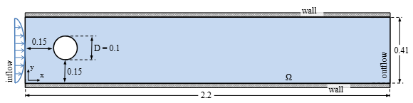
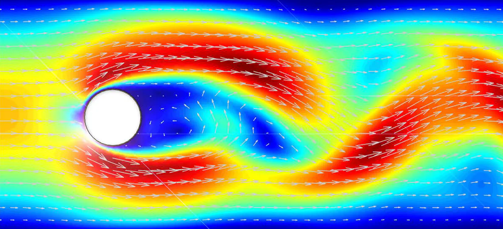

# 2 · Geometria do Problema

**Parâmetros** em unidades SI:

```cpp
const T lengthX = 2.2;              // m
const T lengthY = 0.41 + L;         // m
const T centerCylinderX = 0.2;      // m
const T centerCylinderY = 0.2 + L/2.; 
const T radiusCylinder  = 0.05;     // m
```

O perfil de velocidade na entrada é um **Poiseuille** com
$u_{max}=0.2$   m·s⁻¹, resultando em $Re = 20$.

## Esquema



## Solução esperada

